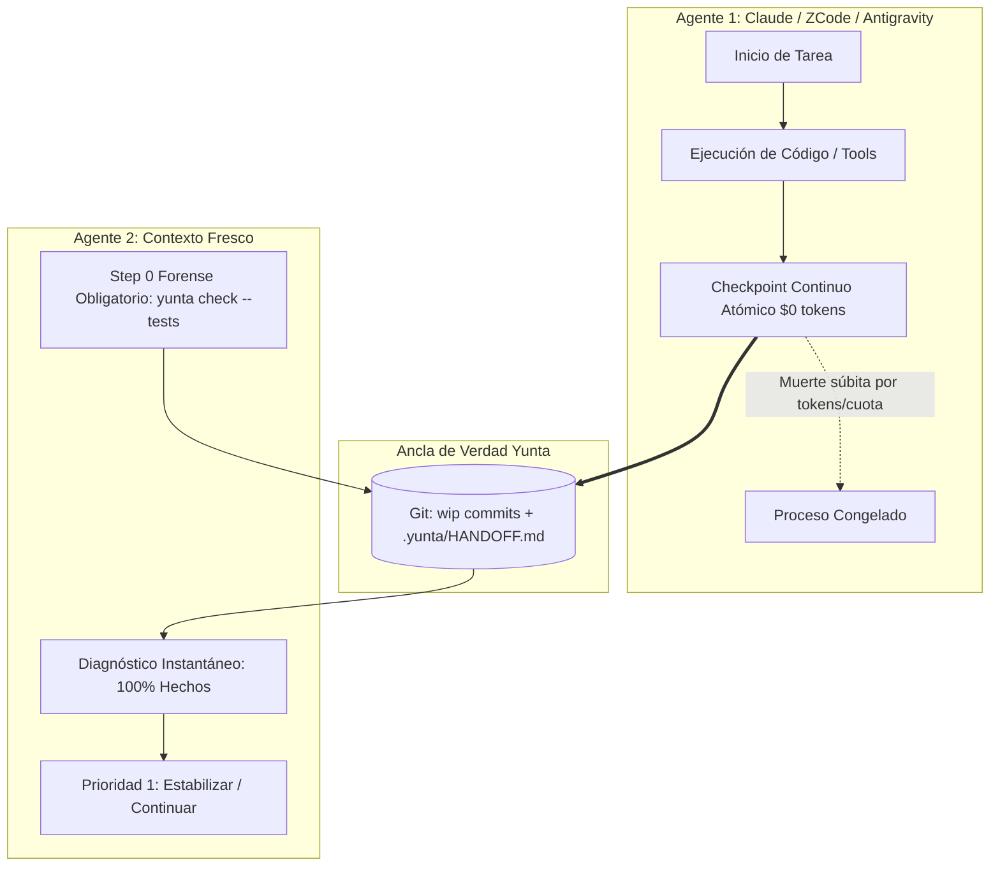

# Metodología Yunta: Protocolo de Continuidad y Relevo Multi-Agente

> **Versión:** 1.0 (2026-09-20)  
> **Ámbito:** Gobernanza, Arquitectura y Flujo de Trabajo Multi-IDE / Multi-Agente  
> **Compatibilidad:** Claude Code, ZCode, Antigravity, Cursor, VSCode, CI/CD

---

## 1. La Problemática: La Paradoja de la Amnesia en Agentes de Código

En equipos de ingeniería modernos, múltiples agentes de inteligencia artificial (modelos distintos, interfaces variadas e IDEs heterogéneos) colaboran sobre un mismo repositorio. Sin embargo, todos los frameworks actuales padecen de **tres fallos estructurales**:

1. **Colapso Terminal de Contexto:** Cuando un agente agota su cuota de tokens o la ventana de contexto de la API, el proceso se congela o es abortado por el proveedor. El agente **no tiene la posibilidad física de ejecutar herramientas ni de escribir un informe de salida**.
2. **Aislamiento en Memoria Volátil:** Cada IDE (Claude Code, Cursor, Antigravity, ZCode) almacena el historial y los razonamientos en su propia memoria RAM. Si la sesión muere o el usuario cambia de herramienta, el nuevo agente inicia en blanco.
3. **Puntos Ciegos en el Working Tree:** Agentes que dejan código a medias sin commitear, o que guardan notas en carpetas locales ignoradas (`scratch/`), resultan invisibles para inspecciones superficiales (`git status`).
4. **El Humano como "Mula de Contexto":** El desarrollador se ve degradado a copiar manualmente notas entre terminales, anulando la promesa de autonomía.

---

## 2. Los 4 Principios del "Modelo Yunta"

La **Metodología Yunta** traslada la responsabilidad de la continuidad desde la "buena voluntad" del modelo hacia el **software determinista del harness local**. Yunta es un ejecutable local (Python/CLI) que no gasta tokens, no sufre amnesia y tiene acceso continuo a Git y al sistema de archivos.



### Principio 1: Persistencia Zero-Tokens
La memoria de sesión y el estado de la tarea no deben depender de que al LLM "le queden tokens al final". El harness local de Yunta registra el estado en disco de forma atómica y continua en cada turno exitoso a costo financiero y computacional cero ($0).

### Principio 2: Diagnóstico Forense Asimétrico (Step 0)
El agente saliente no siempre puede avisar; por tanto, la carga de la prueba recae en el **agente entrante**. Ningún agente tiene permitido generar código ni consultar al usuario sin antes auditar activamente el working tree y la suite de tests (`yunta check --tests` + `git status`).

### Principio 3: Git como Única Ancla de Verdad Inmutable
No existe estado válido que resida únicamente en la memoria volátil de un chat. Si una tarea queda incompleta por agotamiento de cuota, el agente debe sellarla con un commit preventivo (`wip: <qué falta y qué tests están rotos>`). El siguiente agente solo necesita leer `git log -1` para entender el punto exacto de interrupción.

### Principio 4: Operador Único Secuencial (Single-Operator Handshake)
Múltiples agentes y humanos pueden colaborar a lo largo del día, pero **nunca dos agentes en paralelo sobre el mismo working tree**. El traspaso de mando se realiza mediante el buzón canónico formal (`.yunta/HANDOFF.md`) y la especificación de sesión de Yunta (`yunta handoff`).

---

## 3. Arquitectura Técnica en el Repositorio

El Modelo Yunta se materializa en componentes de software específicos ya integrados en el harness:

| Componente | Archivo / Comando | Rol en la Metodología |
|---|---|---|
| **Gatekeeper de Gobernanza** | `yunta check [--tests]` (`yunta/governance.py`) | Audita en <200 ms la presencia de specs, estado de Git, relevos pendientes y salud de tests. |
| **Buzón Canónico de Relevo** | `.yunta/HANDOFF.md` | Ubicación fija y oficial para notas narrativas de traspaso (evitando la carpeta temporal `scratch/`). |
| **Spec Pública de Handoff** | `docs/schemas/yunta-session-spec-v1.{schema.json,md}` | Esquema JSON draft 2020-12 que estandariza mensajes, usage, permisos y hash del árbol para cualquier IDE externo. |
| **Handoff CLI** | `yunta handoff export/import` (`yunta/handoff.py`) | Serialización y deserialización portable del estado de ejecución entre harnesses distintos. |
| **Action de CI/CD** | `.github/actions/check/action.yml` | Bloquea pull requests en GitHub si un relevo dejó tests con fallos o violaciones de gobernanza. |

---

## 4. Guía de Ejecución Inter-IDE (El "Paso 0")

Cualquier agente que tome el control del repositorio (ZCode, Claude Code, Antigravity, Cursor) debe seguir estrictamente este flujo de trabajo:

```bash
# 1. Ejecutar diagnóstico forense de entrada
yunta check --tests
git status

# 2. Si hay un relevo formal, consultar el buzón canónico
cat .yunta/HANDOFF.md

# 3. Evaluar el estado:
#    - ¿Hay archivos modificados o tests rotos?
#      -> Prioridad #1: Estabilizar y documentar ese trabajo antes de iniciar nada nuevo.
#    - ¿El working tree está limpio y la suite en verde?
#      -> Proceder con la nueva tarea solicitada por el usuario.

# 4. Al finalizar la tarea o ante relevo inminente:
#    - Dejar el repo en verde con commit registrado en CHANGELOG.md,
#    - O registrar un commit "wip: ..." si la cuota está por agotarse.
```

---

## 5. Regla Formal en `AGENTS.md`

Esta metodología está formalizada como la **Regla 7** obligatoria en `AGENTS.md`:

> *"Protocolo de Relevo y Continuidad (Step 0 obligatorio): Este repositorio es colaborativo y multi-agente sobre el mismo working tree. Todo agente que inicie turno debe auditar el estado con `yunta check --tests` y `git status`. La prioridad #1 absoluta ante cambios previos es estabilizarlos antes de proponer tareas nuevas. El traspaso estructurado usa `yunta handoff` y el buzón canónico `.yunta/HANDOFF.md`. Queda estrictamente prohibido el trabajo fantasma."*

---

## 6. Conclusión y Visión de Producto

Así como el protocolo **MCP** (*Model Context Protocol*) estandarizó cómo las herramientas se conectan a los modelos, la **Metodología Yunta** estandariza cómo **el trabajo de un agente sobrevive al cambio de IDE, modelo o agotamiento de tokens**. 

El repositorio deja de ser un espacio frágil donde los agentes se pisan los unos a los otros, convirtiéndose en un entorno continuo, auditable y verdaderamente profesional.
