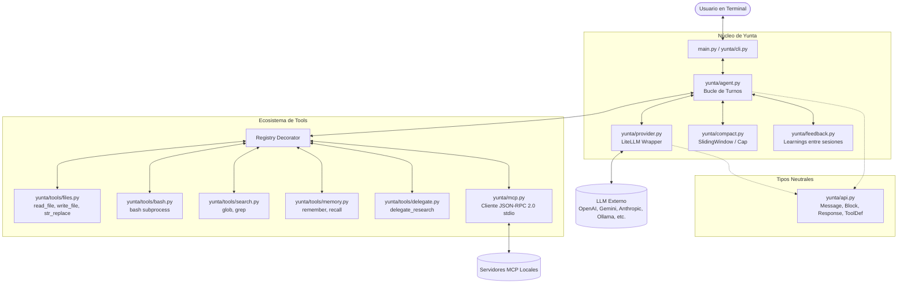

# Arquitectura del Sistema – Yunta

*Yunta* es un harness de agente de código para terminal de alta fidelidad, minimalista (~500 líneas de código central) y estrictamente agnóstico al proveedor del modelo.

Este documento describe la estructura arquitectónica del sistema, sus principios de diseño fundamentales y los detalles de implementación técnica para desarrolladores y usuarios avanzados.

---

## 1. Principios de Diseño

1. **Agnóstico al Proveedor por Construcción**: Ningún SDK de proveedor (OpenAI, Anthropic, Google, etc.) se importa fuera de `yunta/provider.py`. Toda la lógica de agentes, herramientas y compactación opera exclusivamente sobre tipos canónicos neutrales definidos en `yunta/api.py`.
2. **Zero-Frameworks**: Sin LangChain, CrewAI, AutoGen ni librerías pesadas de agentes. El bucle de ejecución, la aprobación de permisos, el manejo de contexto y el cliente MCP están escritos desde cero de forma transparente y concisa.
3. **El Modelo es Elección del Usuario**: No existen modelos ni proveedores por defecto ni fallbacks ocultos. El usuario define explícitamente `LLM_MODEL` en su entorno.
4. **Resiliencia Operativa**: Manejo transparente de reintentos exponenciales ante saturación (429/503), interrupción controlada con `Ctrl+C` sin pérdida de sesión ni corrupción de la secuencia de mensajes, y consola UTF-8 en Windows.
5. **Edición Quirúrgica y Aprobaciones**: Las modificaciones a archivos son inspeccionables mediante previsualizaciones de diffs unificados antes de que el usuario las autorice.

---

## 2. Diagrama de Arquitectura

---

## 3. Desglose de Componentes

### 3.1. Tipos Canónicos Neutrales (`yunta/api.py`)
Define las estructuras inmutables de comunicación independientes de cualquier API externa:
- `Role`: Enumeración de roles (`SYSTEM`, `USER`, `ASSISTANT`, `TOOL`).
- `BlockType`: Tipos de bloques (`TEXT`, `TOOL_USE`, `TOOL_RESULT`).
- `Block`: Representación atómica de contenido (texto libre, llamadas a herramientas con ID y argumentos serializados en JSON, o resultados de ejecución con flags de error).
- `Message`: Agrupación ordenada de bloques por rol.
- `ToolDef`: Esquema JSON-Schema formal para la exposición de herramientas al modelo.
- `Response`: Estructura devuelta por el proveedor con bloques generados, motivo de corte (`stop_reason`) y contabilidad de tokens (`Usage`).

### 3.2. Capa de Proveedor (`yunta/provider.py`)
- Actúa como la única frontera que interactúa con [LiteLLM](https://docs.litellm.ai/).
- Traduce los mensajes neutrales a esquemas compatibles con OpenAI, Anthropic, Gemini, DeepSeek, etc.
- **Streaming y Reensamblado de Fragmentos**: Reensambla fragmentos parciales de texto y llamadas a herramientas divididas en streaming (`streaming tool call chunks`).
- **Auto-Retry Resiliente**: Captura de forma transparente fallos transitorios (`429 Too Many Requests`, `503 Service Unavailable`, `MidStreamFallbackError`) aplicando retroceso exponencial progresivo.

### 3.3. Motor del Agente (`yunta/agent.py`)
- Controla el ciclo iterativo de turnos (`_loop()`) hasta que el modelo emite texto final (`stop_reason = END_TURN`) o se alcanza el límite de turnos (`max_turns`).
- **Interrupción Controlada (`Ctrl+C`)**: Si el usuario interrumpe la ejecución con `KeyboardInterrupt`, el bucle captura la señal, notifica la interrupción, asegura que la invariante de mensajes alternados (User -> Assistant) se cumpla inyectando un mensaje de asistente con texto `[interrumpido por el usuario]`, y retorna la salida parcial acumulada.
- **Flujo de Aprobación Humana**: Si una herramienta tiene `requires_approval=True` (como `write_file`, `str_replace` o comandos de terminal en `bash`), genera una vista previa del detalle (e.g. diff unificado de la edición propuesta) y solicita confirmación interactiva `(y/n)`.

### 3.4. Compactación de Contexto (`yunta/compact.py`)
- Evita desbordamientos de ventana de contexto en conversaciones largas.
- Implementa `SlidingWindow`: Preserva el mensaje de sistema inicial y compacta o trunca los turnos intermedios más antiguos cuando el volumen de tokens o mensajes supera el umbral configurado.

### 3.5. Suite de Herramientas (`yunta/tools/`)
- Registro declarativo mediante decorador `@registry.register(name, description, schema, requires_approval)`.
- **`files.py`**:
  - `read_file`: Lectura segura con manejo de codificaciones UTF-8.
  - `write_file`: Escritura de archivos con confirmación previa y diff unificado.
  - `str_replace`: Edición quirúrgica determinista estilo Anthropic SWE-bench (valida unicidad exacta de la cadena objetivo para evitar ambigüedades).
- **`bash.py`**: Ejecución de comandos de terminal en subproceso con timeout configurable y captura estandarizada de stdout/stderr.
- **`search.py`**: Búsqueda rápida mediante `glob` (patrones de nombres de archivo) y `grep` (búsqueda de texto dentro del árbol del repositorio).
- **`memory.py`**: Persistencia de notas y hechos clave entre sesiones en `.yunta/memory.json`.
- **`delegate.py`**: Spawn de subagentes de investigación de solo lectura para resolver preguntas complejas sin contaminar la memoria del hilo principal.

### 3.6. Cliente MCP Nativo (`yunta/mcp.py`)
- Implementación de cliente **Model Context Protocol (MCP)** mediante transporte estándar `stdio` con JSON-RPC 2.0.
- No depende de librerías externas pesadas.
- Lee `.yunta/mcp.json`, inicia los subprocesos de los servidores MCP configurados, negocia capacidades (`initialize`), descubre herramientas (`tools/list`) y las mapea al registro con el prefijo `mcp__<servidor>__<herramienta>`.

### 3.7. Memoria y Auto-Feedback (`yunta/feedback.py`)
- Al finalizar una sesión (`/exit`), el agente analiza los patrones de éxito/error de la conversación y sintetiza aprendizajes operativos en `.yunta/learnings.md`.
- En la siguiente sesión, `load_system_prompt()` inyecta estas lecciones aprendidas en el preámbulo, logrando auto-mejora continua sin necesidad de reentrenamiento.
