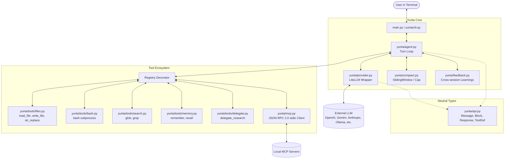

# System Architecture – Yunta

*Yunta* is a high-fidelity, minimalist (~500 lines of core code), strictly provider-agnostic terminal coding agent harness.

This document describes the architectural structure of the system, its foundational design principles, and technical implementation details for developers and advanced users.

---

## 1. Design Principles

1. **Provider-Agnostic by Construction**: Zero provider SDKs (OpenAI, Anthropic, Google, etc.) are imported outside `yunta/provider.py`. All agent logic, tools, and context compaction operate exclusively on canonical neutral types defined in `yunta/api.py`.
2. **Zero-Frameworks**: No LangChain, CrewAI, AutoGen, or heavy agent libraries. The execution loop, permission approvals, context management, and MCP client are written from scratch with extreme clarity and conciseness.
3. **Model Choice Belongs to the User**: No default models, no fallback providers. The user explicitly sets `LLM_MODEL` in their environment.
4. **Operational Resilience**: Built-in exponential backoff retries on API throttling (429/503), graceful interrupt handling with `Ctrl+C` without crashing the REPL session or corrupting conversation role invariants, and automated UTF-8 console configuration on Windows.
5. **Surgical Editing and Human Approvals**: All file modifications are inspectable via unified diff previews before user confirmation.

---

## 2. Architecture Diagram

---

## 3. Component Breakdown

### 3.1. Canonical Neutral Types (`yunta/api.py`)
Defines immutable communication schemas independent of any external LLM library:
- `Role`: Enum (`SYSTEM`, `USER`, `ASSISTANT`, `TOOL`).
- `BlockType`: Block types (`TEXT`, `TOOL_USE`, `TOOL_RESULT`).
- `Block`: Atomic content representation (free-form text, tool calls with ID and serialized JSON arguments, or tool execution outputs with error status).
- `Message`: Role-tagged sequence of content blocks.
- `ToolDef`: Formal JSON-Schema definition exposing tools to the model.
- `Response`: Provider response payload containing generated blocks, finish reason (`stop_reason`), and token consumption telemetry (`Usage`).

### 3.2. Provider Abstraction Layer (`yunta/provider.py`)
- The single isolation boundary interfacing with [LiteLLM](https://docs.litellm.ai/).
- Translates neutral messages to schemas expected by OpenAI, Anthropic, Gemini, DeepSeek, etc.
- **Agnostic Prompt Caching**: Formats the system prompt with `cache_control: {"type": "ephemeral"}` to activate prefix caching for Anthropic Claude and extracts normalized `cached_tokens` across OpenAI, DeepSeek, and Gemini.
- **Streaming & Chunk Reassembly**: Rebuilds fragmented text chunks and split tool calls from streaming responses.
- **Resilient Auto-Retry**: Transparently handles transient errors (`429 Too Many Requests`, `503 Service Unavailable`, `MidStreamFallbackError`) using progressive exponential backoff.

### 3.3. Agent Execution Engine (`yunta/agent.py`)
- Manages the multi-turn agent loop (`_loop()`) until final text is returned (`stop_reason = END_TURN`) or `max_turns` is reached.
- **Graceful Interrupt Handling (`Ctrl+C`)**: Captures `KeyboardInterrupt` inside the loop, prints a clean notification, guarantees LLM role alternation by appending an assistant message `[interrumpido por el usuario]`, and returns whatever output was accumulated so far.
- **Human-in-the-Loop Approvals**: When a tool has `requires_approval=True` (such as `write_file`, `str_replace`, or `bash`), generates an inspectable detail view (e.g. unified diff) and prompts the user for interactive confirmation `(y/n)`.

### 3.4. Context Compaction (`yunta/compact.py`)
- Prevents context window exhaustion in extended pair-programming sessions.
- Implements `SlidingWindow`: Retains the initial system prompt and systematically compacts or discards older intermediate turns once message or token thresholds are exceeded.

### 3.5. Native Tool Suite (`yunta/tools/`)
- Declarative registration via `@registry.register(name, description, schema, requires_approval)`.
- **`files.py`**:
  - `read_file`: Safe file reader with UTF-8 encoding fallbacks.
  - `write_file`: File writer with unified diff preview and approval check.
  - `str_replace`: Deterministic surgical file editor following Anthropic SWE-bench standards (enforces unique string matching to prevent ambiguous edits).
- **`bash.py`**: Subprocess command runner with timeout and unified stdout/stderr capture.
- **`search.py`**: High-speed exploration using `glob` (file patterns) and `grep` (repository text search).
- **`memory.py`**: Cross-session knowledge persistence (`remember`/`recall`) in `.yunta/memory.json`.
- **`delegate.py`**: Read-only subagent spawning for deep research questions without polluting main session context.

### 3.6. Native MCP Client (`yunta/mcp.py`)
- Built-in **Model Context Protocol (MCP)** client using standard `stdio` transport and JSON-RPC 2.0.
- Zero external SDK dependencies.
- Reads `.yunta/mcp.json`, spawns configured MCP servers, initializes protocol handshakes, fetches tool declarations, and registers them dynamically with the prefix `mcp__<server>__<tool>`.

### 3.7. Memory & Auto-Feedback (`yunta/feedback.py`)
- On session close (`/exit`), analyzes conversation trajectories and extracts actionable learnings stored in `.yunta/learnings.md`.
- On future startup, `load_system_prompt()` injects these learnings into the system preamble, providing autonomous compounding improvement.
