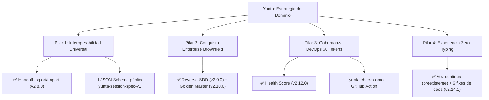

# Análisis Estratégico de Yunta — Versión Corregida (estado real)

> Réplica del análisis externo recibido el 2026-09-19, corrigiendo el estado
> de avance de cada propuesta contra el repositorio real
> (`feat/v2.5.0-voice-roi-extractors`, HEAD `a71d3a8`). El documento original
> trataba como "iniciado"/"en curso" trabajo que ya estaba completo,
> testeado y commiteado al momento de escribirse. El contenido estratégico
> (pilares, puntos ciegos) se conserva porque sigue siendo válido — solo se
> corrige el estado de ejecución y se reprioriza la hoja de ruta.

---

## 1. Estado real de las 7 propuestas

| # | Propuesta | Estado real | Evidencia | Atractivo Comercial | Dictamen |
| :-- | :-- | :-- | :-- | :--: | :-- |
| **1** | Portabilidad de Sesión (`handoff`) | ✅ **Completa** — v2.8.0 | `yunta handoff export/import` + `/handoff` REPL, 7 tests, commit `9cc8893` | Crítico / Dispersor de mercado | Falta la mitad "estándar abierto": el schema vive como constante interna (`SCHEMA_VERSION = 1`), nunca se publicó como spec JSON pública. |
| **2** | Reverse-SDD | ✅ **Completa** — v2.9.0 | `yunta reverse-sdd [--apply]`, 9 tests (incluye integración cruzada con `governance.audit_repository`), commit `c6a4df6` | Máximo para Enterprise | Cerrado. Limitación conocida y documentada: solo Python tiene AST real vía `adapters.py`; otros lenguajes generan outlines pobres. |
| **3** | Tests de Caracterización (Golden-Master) | ✅ **Completa** — v2.10.0 | Tool `characterize_function`, subproceso aislado con timeout, 8 tests (incluye ejecución real del pytest generado), commit `3a2c099` | Muy Alto (Seguridad) | Cerrado. Alcance MVP explícito: solo funciones Python top-level. |
| **4** | Memoria de Equipo (`learnings sync`) | ✅ **Completa** — v2.11.0 | `yunta memory sync/init-sync`, formato migrado a JSONL append-only, commit `06dd722` | Medio-Alto | Cerrado. `.gitignore` requiere confirmación humana explícita antes de versionar (no automático). |
| **5** | Agent Health Score | ✅ **Completa** — v2.12.0 | `yunta health [--json]`, `.yunta/health.jsonl`, commit `b45496b` | Alto (para Managers) | Cerrado. `health_score` es heurística v1, documentada como punto de partida, no métrica científica. |
| **6** | Enrutamiento Económico Dinámico | ✅ **Completa** — v2.13.0 | `LLM_CHEAP_MODEL` (100% opt-in, sin default), regla dura anti-edición-barata, commit `d172053` | Medio-Alto | Cerrado y **verificado contra la regla 2 de AGENTS.md**: sin la env var, el comportamiento es idéntico a hoy — no hay fallback oculto. |
| **7** | Undo como Árbol (Best-of-N) | ✅ **Completa** — v2.14.0 | `/bestof <n> <tarea>`, ejecución secuencial (decisión de alcance explícita, no paralela), commit `c4885dc` | Medio | Cerrado. Costo ya pagado (~90 líneas, comando opt-in que no toca `/sandbox`); la duda de "nicho" es de promoción, no de construcción. |

**Adenda no listada en el documento original**: 6 defectos de runtime en el subsistema de voz/TTS encontrados por testing adversarial del usuario (`tests/test_voice_chaos.py`, ahora trackeado), corregidos en v2.14.1, commit `a71d3a8`. El documento original solo menciona 2 ("condición de carrera de prefetch TTS" y "chequeo de `session_permissions`"); los otros 4 (excepción no capturada en el hilo de habla, emoji duplicando argumento del router, código Markdown sin cerrar filtrado a voz, error engañoso en audio de 0 bytes) no aparecían.

---

## 2. Puntos ciegos estratégicos — vigentes, sin cambios

El análisis de que la revisión original miró Yunta "desde el escritorio" y no desde ventajas ya construidas sigue siendo correcto. Ninguno de estos tres puntos requiere código nuevo para el punto A/B (son de comunicación/posicionamiento); el punto C sí es una construcción real pendiente:

- **(A) Hands-Free como experiencia ejecutiva/móvil** — la capacidad (VAD, prefetch TTS, router fonético, aprobación hablada) ya existe desde v2.4.0-v2.7.5, antes de esta sesión. Lo que falta es **comunicarlo** así, no construirlo.
- **(B) Anti-Lock-in Pledge (soberanía/compliance)** — mismo caso: la arquitectura agnóstica al proveedor es una regla inviolable desde el commit fundacional (`AGENTS.md` regla 1-2). Falta el mensaje de venta a bancos/fintech/gobierno, no la ingeniería.
- **(C) `yunta check` como GitHub Action** — **este es el único ítem del documento completo que sigue genuinamente pendiente y es una construcción real, no solo comunicación.** `yunta check --json` existe y es determinista/$0-tokens desde v1.0.9, pero nunca se empaquetó como Action reutilizable de CI.

---

## 3. Los 4 pilares — estado corregido

| Pilar | Objetivo | Estado |
| :-- | :-- | :-- |
| 1. Interoperabilidad Universal | Estándar de sesiones portables | **Núcleo completo.** Falta solo publicar el schema como spec pública versionada — hoy es un detalle de implementación interno, no un documento que otro harness pueda adoptar. |
| 2. Conquista Brownfield | SDD sobre repos legacy sin miedo a romper producción | **Completo** (reverse-sdd + characterization tests). |
| 3. Gobernanza DevOps $0 Tokens | Vender predictibilidad a Engineering Managers | **Mitad completa.** Health score sí; el gate de CI/CD (GitHub Action) no existe todavía — es la pieza que realmente conecta esto con "el pipeline DevOps". |
| 4. Zero-Typing | Liderazgo en interacción multimodal | **Completo y ahora más robusto** (6 bugs de concurrencia/edge-cases cerrados). Pendiente solo la comunicación de mercado (punto A). |

---

## 4. Hoja de ruta — reprioridad contra el estado real

El "Sprint de Consolidación" del documento original (terminar reverse-sdd, corregir 2 bugs de voz) **ya está hecho**. Lo que queda genuinamente por delante, en orden de esfuerzo/impacto:

1. **Ahora — bajo esfuerzo, alto impacto**: empaquetar `yunta check` como GitHub Action reutilizable (Pilar 3, único hueco de construcción real).
2. **Corto plazo — documentación, no código**: formalizar `yunta-session-spec-v1` como JSON Schema público versionado (Pilar 1); escribir el mensaje de posicionamiento hands-free/anti-lock-in (puntos A y B) en README/docs de cara a mercado.
3. **Mediano plazo — decisión de producto, no técnica**: decidir si vale la pena invertir en promocionar Best-of-N (Feature 7) como diferenciador, o dejarlo como capacidad opt-in de nicho sin empujarlo en el mensaje principal.

---

## Estado

✅ Documento de corrección completo.
✅ GitHub Action de `yunta check` — `CHANGELOG.md` [2.14.2], `.github/actions/check/`, dogfooding en `ci.yml`.
✅ Spec JSON pública del handoff — `docs/schemas/yunta-session-spec-v1.{schema.json,md}`, 4 tests de conformidad.
✅ Fix defensivo de `session_permissions=None` en voz (latente, no listado en los 6 originales).
⬜ Mensaje de posicionamiento (hands-free, anti-lock-in) — pendiente, es redacción de cara a mercado, no código.
⬜ Decisión sobre promover Best-of-N — abierta, es decisión de producto.
