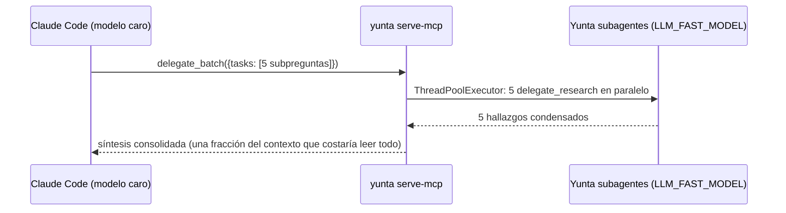
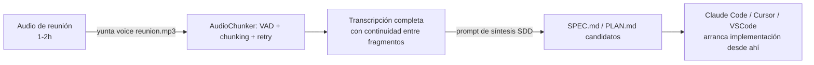
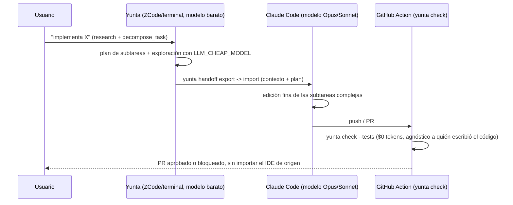
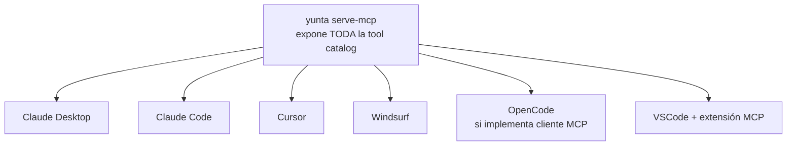

# Flujos de Trabajo Integrados: Yunta + Otros IDEs/Agentes

> Proyección de flujos concretos usando las capacidades ya construidas en
> Yunta (handoff, MCP, voz, reverse-SDD, characterization tests, best-of-N,
> governance gate) combinadas con Claude Code, ZCode, OpenCode, VSCode y
> Antigravity. No es aspiracional: cada flujo cita el comando/módulo real
> que ya existe en el repo.

## Los 4 mecanismos de integración que ya existen

Todo lo que sigue se apoya en solo cuatro puntos de enganche, ya construidos:

| Mecanismo | Comando/módulo | Quién lo consume |
|---|---|---|
| **Servidor MCP** | `yunta serve-mcp` (`yunta/server_mcp.py`) | Claude Desktop, Claude Code, Cursor, Windsurf, VSCode con extensión MCP — cualquier cliente MCP |
| **Servidor NDJSON** | `yunta serve-json` (`yunta/json_server.py`) | Integraciones ligeras de IDE sin montar el protocolo MCP completo (ej. `yunta-vscode-extension`) |
| **Handoff bundle** | `yunta handoff export/import` (`yunta/handoff.py`), spec pública en `docs/schemas/yunta-session-spec-v1.schema.json` | Cualquier harness que lea/escriba el JSON — no requiere que el otro lado sea Yunta |
| **Convención `AGENTS.md`** | Archivo en la raíz del repo | ZCode y Antigravity ya lo leen automáticamente (verificado en `CHANGELOG.md` v0.1.1); Claude Code lee `CLAUDE.md`/`AGENTS.md`; la mayoría de agentes de terminal siguen esta convención |

---

## Categoría 1 — Flujos de Investigación

### R1. Investigación barata delegada desde un IDE caro (MCP)

Un desarrollador en Claude Code (o Cursor/Windsurf) necesita explorar un
repo grande antes de decidir un enfoque. En vez de gastar el contexto caro
de Claude Code leyendo archivo por archivo, delega la exploración a Yunta
corriendo con un modelo barato.



Consumo real: `yunta/tools/delegate.py::delegate_batch`, expuesto vía
`yunta/server_mcp.py`. Claude Code lo ve como una tool más de su catálogo.

### R2. Reverse-SDD como paso de onboarding antes de abrir el IDE

Alguien nuevo en el equipo hereda un repo sin specs. Antes de pedirle a
Claude Code/Cursor que "explique la arquitectura" (gastando tokens caros
en explorar todo), se corre una vez, standalone:

```bash
yunta reverse-sdd . --apply
```

`AGENTS.md`/`SPEC.md` quedan generados por ingeniería inversa
(`yunta/reverse_sdd.py`, reutiliza los adaptadores AST de
`tools/symbols.py`). Al abrir el repo en cualquier IDE después, ese IDE lee
un contexto ya condensado y estructurado en vez de tener que inferirlo de
cero — el costo de entender el repo se paga **una sola vez, con el modelo
más barato posible**, no una vez por cada IDE/agente que lo toque después.

### R3. Research por voz en movimiento → handoff al escritorio

Mientras camina, el usuario dicta una pregunta de investigación
(`yunta voice`, VAD + router fonético). Yunta corre `delegate_research` con
modelo barato y exporta el resultado:

```bash
yunta handoff export --path research.json
```

Al llegar al escritorio con Claude Code/VSCode abierto:

```bash
yunta handoff import research.json
```

El contexto de la investigación de voz queda cargado sin re-explicar nada
— la sesión de escritorio continúa con el modelo caro exactamente donde
quedó la de voz.

---

## Categoría 2 — Flujos de Transcripción

### T1. Reunión de scoping → `SPEC.md` sin escribir una palabra



Reutiliza `AudioTranscriber`/`AudioChunker` (`yunta/voice.py`) y
`generate_study_notes` ya existente. El desarrollador nunca tipeó el spec —
lo dictó en la reunión.

### T2. Aprobación hablada de un best-of-N generado por otro IDE

Un tech lead revisa cambios generados por Claude Code en VSCode pero
prefiere aprobar sin teclado (ej. revisando en una segunda pantalla).
Yunta genera las alternativas (`/bestof 3 <tarea>`, `yunta/bestof.py`) y la
aprobación de cuál integrar se hace por voz (`make_voice_approval`,
`normalize_voice_response`). Al elegir, `cleanup_sandbox(..., merge=True)`
deja el working tree listo para que VSCode/Claude Code simplemente
recarguen el estado y sigan iterando.

### T3. "Explícame esta función en voz" → test de caracterización

Alguien graba explicando de memoria qué hace una función legacy sin specs
("calcula el descuento pero no recuerdo la regla exacta"). Yunta
transcribe, y en el mismo turno invoca `characterize_function`
(`yunta/tools/characterize.py`) sobre esa función — genera el golden-master
test ANTES de que cualquier IDE toque el código. Claude Code/Cursor
refactorizan después con esa red de seguridad ya puesta.

---

## Categoría 3 — Flujos de Desarrollo Iterativo

### D1. Split "cerebro barato / cerebro caro" entre Yunta y Claude Code



El razonamiento caro se reserva para lo que realmente lo necesita
(`LLM_CHEAP_MODEL`, Feature 6); el gate de calidad es el mismo sin importar
qué IDE terminó el trabajo (`.github/actions/check/`, Feature del backlog
recién cerrado).

### D2. Best-of-N con diff visual en VSCode

`/bestof` ya deja cada enfoque en su propio worktree
(`.yunta/sandboxes/bestof-N`). En vez de leer el diff solo en terminal:

```bash
code .yunta/sandboxes/bestof-1
code .yunta/sandboxes/bestof-2
```

El desarrollador compara con el diff viewer nativo de VSCode/Claude Code
extension antes de decidir cuál integrar por voz o por `/bestof` elección
numérica.

### D3. Handoff mid-task ZCode ↔ Antigravity/Claude Code

Tarea larga: arranca en terminal con ZCode+Yunta y un modelo local/barato
para todo el trabajo mecánico (leer, entender estructura, primer borrador).
A mitad de camino aparece la parte que necesita razonamiento profundo real.

```bash
# En ZCode/terminal:
yunta handoff export --path tarea-compleja.json
```

Se abre `tarea-compleja.json` en Claude Code o Antigravity (ambos ya
compatibles con `AGENTS.md`, y Antigravity con `GEMINI.md`) — el bundle es
JSON plano, cualquier harness que implemente el schema público
(`docs/schemas/yunta-session-spec-v1.md`) puede leerlo sin depender del
código de Yunta. Al terminar la parte difícil, opcionalmente se exporta de
vuelta para cerrar con `yunta check`/tests a costo $0.

### D4. MCP como pegamento universal (incluye OpenCode)



Todas las 7 features nuevas de esta sesión (handoff, reverse-sdd,
characterize_function, memory sync, health, routing económico, best-of-N)
quedan disponibles como tools MCP estándar apenas se registran en
`yunta/tools/__init__.py` y se listan en `server_mcp.py` — cualquier
cliente MCP las ve como tools nativas propias, sin reinventar nada. Esto
incluye a **OpenCode**: en la medida en que soporte MCP (protocolo abierto,
no propietario de Anthropic), se conecta exactamente igual que Claude Code.

### D5. Gate de gobernanza agnóstico al origen del código

El caso más simple y ya construido: `.github/actions/check/` corre sobre
CUALQUIER PR, sin que le importe si el código salió de Claude Code, Cursor,
ZCode+Yunta, OpenCode o un humano. Es el único punto de la matriz que no
requiere que el otro IDE "sepa" de Yunta en absoluto — solo que el repo
tenga la Action en su CI.

---

## Matriz resumen: workflow → mecanismo → herramientas involucradas

| Workflow | Mecanismo | IDEs/herramientas |
|---|---|---|
| R1 — Investigación delegada | MCP | Claude Code, Cursor, Windsurf |
| R2 — Reverse-SDD onboarding | Standalone CLI + `AGENTS.md` | Cualquier IDE que lea `AGENTS.md`/`CLAUDE.md` |
| R3 — Research por voz + handoff | Voz + Handoff bundle | ZCode/terminal → Claude Code/VSCode |
| T1 — Reunión → SPEC.md | Voz standalone | Cualquier IDE (consume el `.md` resultante) |
| T2 — Aprobación hablada de best-of-N | Voz + sandboxes | VSCode + Claude Code extension |
| T3 — Voz → characterization test | Voz + tool nativa | Cualquier IDE (hereda el test) |
| D1 — Split barato/caro | Handoff + GitHub Action | ZCode → Claude Code → CI |
| D2 — Best-of-N visual | Sandboxes de worktree | VSCode / Claude Code |
| D3 — Handoff mid-task | Handoff bundle (spec pública) | ZCode ↔ Antigravity/Claude Code |
| D4 — MCP universal | MCP | Claude Desktop, Claude Code, Cursor, Windsurf, OpenCode, VSCode |
| D5 — Gate de gobernanza | GitHub Action | Cualquier repo, cualquier origen de código |
