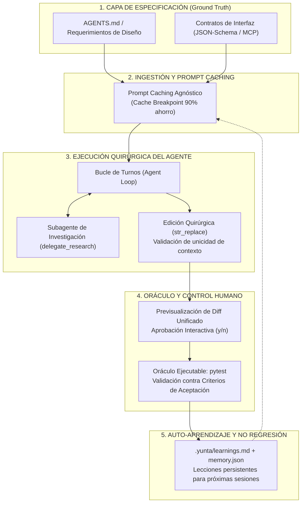

# Yunta & Spec-Driven Development (SDD)
### *El Harness de Agentes de Código Guiado por Especificaciones*

> **"Un modelo sin especificación alucina; un agente con especificación construye."**
> *Yunta no es un chat generador de código: es un harness determinista que convierte especificaciones en software probado.*

---

## 1. El Gran Dilema: ¿"Vibe Coding" o "Spec-Driven Development"?

En el auge de los agentes de IA existen dos caminos opuestos para construir software:

| Dimensión | Vibe Coding (Prompting Informal) | Spec-Driven Development (SDD con Yunta) |
| :--- | :--- | :--- |
| **Fuente de Verdad** | La memoria volátil de la ventana de chat | Contratos formales (`AGENTS.md`, OpenAPI, JSON-Schema) |
| **Modificación de Código** | Reescritura ciega de archivos enteros | Edición quirúrgica determinista (`str_replace`) |
| **Control de Daños** | "Pruébalo y me avisas si falla" | Previsualización interactiva de Diffs unificados |
| **Criterio de Éxito** | Respuestas convincentes en lenguaje natural | Oráculo ejecutable: **100% de tests en verde** |
| **Economía de Contexto** | Multiplicación lineal de costos y lentitud | **Prompt Caching agnóstico**: hasta 90% de ahorro |
| **Evolución del Proyecto** | Regresiones recurrentes al olvidar restricciones | Memoria acumulativa y auto-feedback (`learnings.md`) |

**Yunta fue diseñado desde su primer commit para operar bajo SDD**: proveer una infraestructura minimalista, auditable y robusta que garantice que el modelo trabaje **para** la especificación, y nunca al revés.

---

## 2. El Ciclo de Vida SDD en Yunta

El siguiente diagrama ilustra cómo fluye un requerimiento en Yunta desde la especificación hasta la entrega verificada:



---

## 3. Los 6 Pilares del Cruce Yunta × SDD

### Pilar 1: La Especificación como Contrato Inviolable (`AGENTS.md`)
En SDD, el código es un subproducto de la especificación. Yunta implementa esto como un axioma de diseño:
- `load_system_prompt()` localiza automáticamente `AGENTS.md` en la raíz del proyecto y lo ancla en la cabecera del System Prompt.
- Reglas fundamentales (como *cero frameworks*, *aislamiento de SDKs*, *tests obligatorios*) quedan fijadas de forma inmutable. El modelo no puede decidir "ignorar" las reglas arquitectónicas del equipo.

### Pilar 2: Herramientas como Contratos Formales de Datos
Las herramientas no reciben texto libre no estructurado:
- Cada tool registrada con `@registry.register` expone un esquema estricto de **JSON-Schema** (`ToolDef.parameters`).
- Si el modelo produce argumentos que violan la especificación, el error de validación regresa al contexto del modelo en el mismo turno, forzando la autocorrección inmediata antes de cualquier impacto en el sistema.

### Pilar 3: Edición Quirúrgica Determinista (`str_replace`)
El mayor destructor de especificaciones en agentes convencionales es la reescritura masiva de archivos (*blind file overwrite*). Yunta erradica esto:
- La herramienta `str_replace` (inspirada en SWE-bench y Claude Code) exige coincidencia contextual exacta y única. Si la cadena objetivo aparece 0 veces o más de 1 vez, la tool aborta con una advertencia de ambigüedad.
- **Diff Unificado**: Antes de tocar el disco, el usuario visualiza exactamente las líneas añadidas (+) y eliminadas (-) en la consola.

### Pilar 4: El Oráculo Ejecutable de Aceptación (`pytest`)
Una especificación sin verificación es solo una expresión de deseo:
- En la filosofía de Yunta, ninguna tarea se considera resuelta hasta que el comando de prueba que la valida haya salido con código `0`.
- En cada ciclo de dogfooding, Yunta no solo implementa el cambio, sino que escribe el test unitario que formaliza los criterios de aceptación y ejecuta `python -m pytest` de forma autónoma.

### Pilar 5: Prompt Caching como Habilitador Económico
En SDD tradicional, documentar especificaciones exhaustivas resultaba prohibitivo porque enviar 10,000 tokens de reglas en cada turno volvía al agente lento y costoso.
- Con el **Prompt Caching de Yunta (v0.11.0)**:
  - El System Prompt (`AGENTS.md` + directivas) se marca con `cache_control: {"type": "ephemeral"}`.
  - Anthropic Claude, OpenAI, DeepSeek y Gemini leen la especificación del caché con un **90% de descuento y latencia reducida en hasta 80%**.
  - **Resultado**: Puedes escribir especificaciones tan ricas y detalladas como requiera tu arquitectura sin preocuparte por el costo acumulado por turno.

### Pilar 6: Memoria y Protección contra Regresiones
Un principio clave de SDD es que las decisiones de diseño del pasado deben preservarse.
- Al salir (`/exit`), `yunta/feedback.py` sintetiza aprendizajes operativos en `.yunta/learnings.md`.
- En la siguiente ejecución, el agente inicia recordando las trampas y lecciones anteriores, garantizando que el software evolucione sin romper contratos preexistentes.

---

## 4. Guía Práctica: Cómo Desarrollar con Yunta en Flujo SDD

### Paso 1: Escribe tu Especificación (`AGENTS.md`)
Define las reglas del proyecto, comandos de prueba y convenciones no negociables:
```markdown
# AGENTS.md
- Base de datos: SQLAlchemy 2.0 con asyncpg. Prohibido queries en crudo sin tipado.
- Pruebas: Toda nueva función debe contar con su correspondiente test en tests/.
- Verificación: python -m pytest tests/
```

### Paso 2: Plantea el Requerimiento Especificado
En lugar de *"haz una función para usuarios"*, plantea la especificación:
```text
> Implementa el endpoint POST /users validando email único según RFC 5322.
  Crea el test en tests/test_users.py y verifica que pase con pytest.
```

### Paso 3: Supervisa la Auditoría de Diff
Yunta usará `str_replace`, te mostrará el diff unificado del cambio propuesto y solicitará tu confirmación:
```diff
--- app/models.py
+++ app/models.py
@@ -12,4 +12,8 @@
+    email: Mapped[str] = mapped_column(String(255), unique=True, nullable=False)
```
Presiona `y` para autorizar.

### Paso 4: Certificación del Oráculo
Yunta ejecutará la suite de pruebas automáticamente:
```text
[tool] bash {"command": "python -m pytest tests/test_users.py"}
1 passed in 0.45s
```

---

## 5. Resumen Ejecutivo

> **Yunta + SDD** representa el equilibrio ideal entre la inteligencia probabilística de los modelos de lenguaje y el rigor determinista de la ingeniería de software:
> - **El humano y el equipo arquitecto** definen la especificación (`AGENTS.md`).
> - **Yunta** ejecuta de forma quirúrgica, económica y verificada contra esa especificación.
