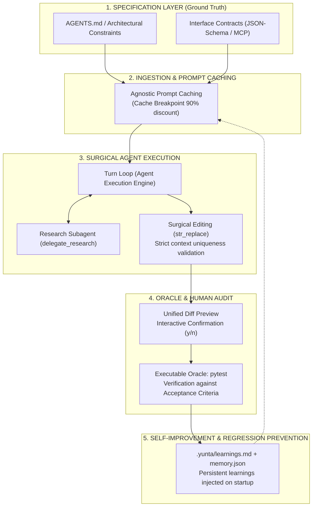

# Yunta & Spec-Driven Development (SDD)
### *The Specification-First Agentic Coding Harness*

> **"A model without a specification hallucinates; an agent with a specification builds."**
> *Yunta is not an informal code chat: it is a deterministic harness that turns specifications into verified software.*

---

## 1. The Core Dilemma: "Vibe Coding" vs. "Spec-Driven Development"

With the rise of AI coding agents, two distinct engineering philosophies have emerged:

| Dimension | Vibe Coding (Informal Prompting) | Spec-Driven Development (SDD with Yunta) |
| :--- | :--- | :--- |
| **Ground Truth** | Fleeting conversation window memory | Formal project contracts (`AGENTS.md`, OpenAPI, JSON-Schema) |
| **Code Modification** | Blind full-file rewrites | Deterministic surgical edits (`str_replace`) |
| **Damage Control** | "Run it and let me know if it breaks" | Interactive Git-style Unified Diff inspection |
| **Success Criteria** | Eloquent natural language responses | Executable oracle: **100% green tests** |
| **Context Economics** | Linear cost growth and sluggish latency | **Agnostic Prompt Caching**: up to 90% savings |
| **Architecture Evolution**| Repeated regressions as context slips | Continuous compounding learnings (`learnings.md`) |

**Yunta was built from commit zero around SDD principles**: providing an ultra-minimalist, auditable, and robust harness ensuring the model works **for** the specification, never the other way around.

---

## 2. The SDD Lifecycle in Yunta

The diagram below illustrates how requirements flow through Yunta from formal specification to verified code:



---

## 3. The 6 Pillars of the Yunta × SDD Intersection

### Pillar 1: The Specification as an Inviolable Contract (`AGENTS.md`)
In SDD, code is an artifact derived from specifications. Yunta embeds this as a core invariant:
- `load_system_prompt()` locates `AGENTS.md` at the project root and anchors it into the System Prompt.
- Inflexible ground rules (such as *zero agent frameworks*, *provider isolation in `provider.py`*, *mandatory test validation*) are non-negotiable. The model cannot bypass the team's architectural decrees.

### Pillar 2: Tools as Formal Schema Contracts
Tools do not receive unstructured, ambiguous text:
- Every tool registered via `@registry.register` specifies a strict **JSON-Schema** (`ToolDef.parameters`).
- If the model generates parameters that violate the contract, the validation error is fed back into the context within the same turn, compelling immediate self-correction before any side-effects occur.

### Pillar 3: Deterministic Surgical Editing (`str_replace`)
The most common cause of architectural decay with coding assistants is blind full-file overwrites. Yunta eliminates this:
- The `str_replace` tool (adhering to SWE-bench and Claude Code standards) demands exact context uniqueness. If the target string matches 0 or >1 times, the tool halts with an ambiguity error.
- **Unified Diff**: Before writing changes to disk, the developer reviews an exact Git-style diff (+/-) right in the terminal.

### Pillar 4: The Executable Acceptance Oracle (`pytest`)
A specification without automated verification is merely wishful thinking:
- In Yunta's philosophy, no task is marked as resolved until the corresponding test command exits with code `0`.
- In every dogfooding round, Yunta implements the code, adds the test that codifies the acceptance criteria, and runs `pytest` autonomously.

### Pillar 5: Prompt Caching as an Economic Enabler
In classical development, sending rich 10,000-token specifications on every single prompt was cost-prohibitive and slow.
- With **Yunta's Prompt Caching (v0.11.0)**:
  - The System Prompt (`AGENTS.md` + instructions) is tagged with `cache_control: {"type": "ephemeral"}`.
  - Anthropic Claude, OpenAI, DeepSeek, and Gemini read cached prefixes at a **90% discount with up to 80% reduced TTFT**.
  - **Takeaway**: You can write deep, comprehensive specifications without worrying about token budgets.

### Pillar 6: Memory & Anti-Regression Guards
A critical tenet of SDD is that design decisions must not be forgotten.
- Upon session exit (`/exit`), `yunta/feedback.py` condenses operational lessons into `.yunta/learnings.md`.
- In subsequent runs, Yunta begins with full awareness of past lessons and constraints, preventing regressions.

---

## 4. Practical Guide: Developing with Yunta in an SDD Workflow

### Step 1: Write Your Project Specification (`AGENTS.md`)
Specify non-negotiable architecture patterns, test commands, and boundaries:
```markdown
# AGENTS.md
- ORM: SQLAlchemy 2.0 with asyncpg. No untyped raw queries.
- Tests: Every new feature must have an end-to-end test in tests/.
- Verification command: python -m pytest tests/
```

### Step 2: Prompt with Clear Acceptance Criteria
Instead of *"build a user endpoint"*, provide the spec:
```text
> Implement POST /users with RFC 5322 email uniqueness validation.
  Add tests in tests/test_users.py and verify with pytest.
```

### Step 3: Review the Unified Diff Preview
Yunta calculates the surgical replacement and shows the diff:
```diff
--- app/models.py
+++ app/models.py
@@ -12,4 +12,8 @@
+    email: Mapped[str] = mapped_column(String(255), unique=True, nullable=False)
```
Press `y` to approve.

### Step 4: Automated Verification
Yunta triggers the test oracle automatically:
```text
[tool] bash {"command": "python -m pytest tests/test_users.py"}
1 passed in 0.45s
```

---

## 5. Executive Takeaway

> **Yunta + SDD** delivers the ideal balance between the probabilistic creativity of LLMs and the deterministic discipline of software engineering:
> - **The human engineer and team** establish the contract (`AGENTS.md`).
> - **Yunta** acts as the surgical, cost-efficient, and verified executor of that specification.
